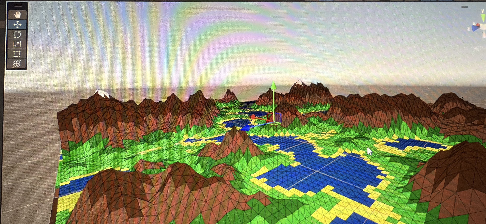
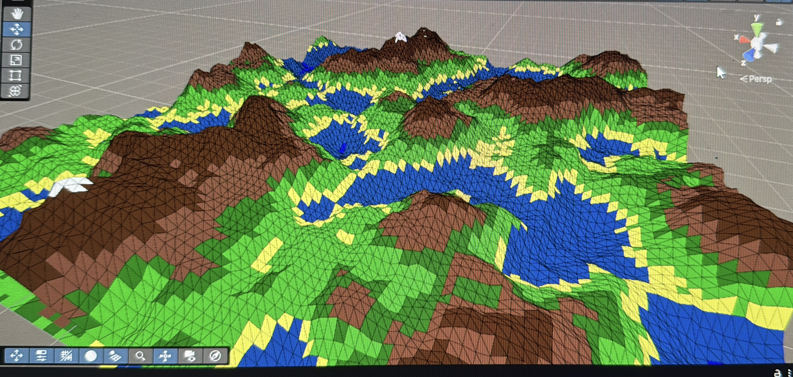
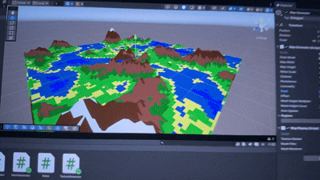
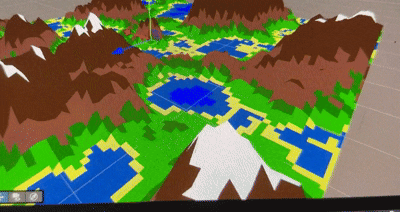

# 3D Map Generator

## Overview
3D Map Generator is a tool that procedurally generates 3D terrain maps.  
The application creates realistic landscapes using noise-based algorithms and allows visualization of the terrain in a 3D environment.
Normally the terrain is generated using the sand, water, hills and moutains with snow.
The generator supports chunk-generation system dinamically adjusted for low-end systems. In this way, chunks that are far away will be generated as you getting closer, and other chunks will be deleted
as you will run away from them.

The generator can be used for:
- game prototyping
- simulation environments
- terrain visualization
- procedural world generation experiments

---

## Features

- Procedural terrain generation
- Adjustable terrain parameters
- 3D visualization
- Random seed support
- Fast terrain rendering
- Chunk generation

---

## Technologies Used

- C# / Unity
- Perlin Noise
- 3D rendering libraries
- Multi-threading for stability

---

## How It Works

The generator uses procedural noise to create terrain heightmaps.  
These heightmaps are then converted into a 3D mesh and rendered in a graphical environment.

Steps:
1. Generate a noise-based heightmap
2. Convert height values into vertices
3. Build a 3D mesh
4. Apply rendering and visualization

---

## Screenshots

### Terrain Example 1

### Terrain Example 2

---

## Demo Videos

### Terrain Generation by Seed Demo

### Navigation on length Demo

